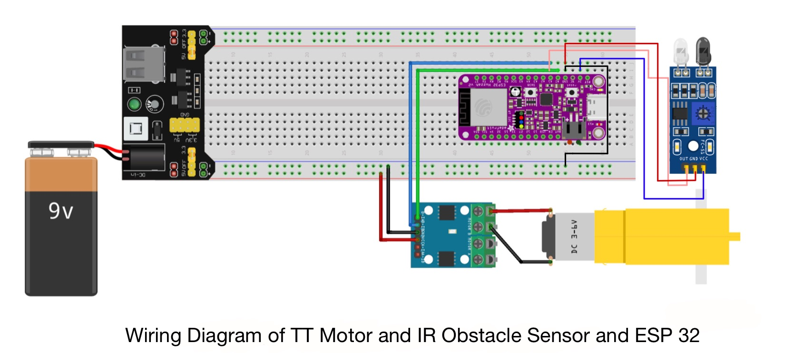
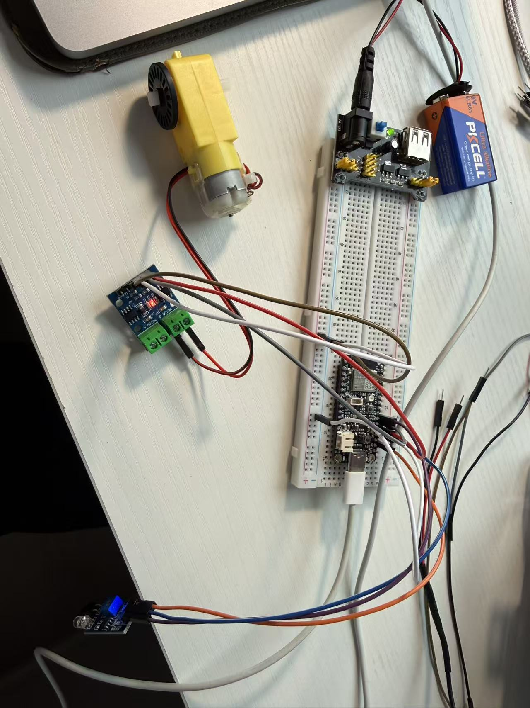

# ecse395-team12-main
ECSE395 Team12 Cat Litter Box

# Prototype 1 – Motor + Safety Gating (TT Motor + L9110S + ESP32 + IR Obstacle Sensor)

**Team:** ECSE 395 Team 12  
**Owner:** Weikang Sun  
**Date:** 2026-03-04  
**Prototype Type / Fidelity:** Medium-fidelity electronics + control logic prototype 

---

## 1) Purpose 

**Primary question:**  
What is the safest and most efficient control behavior for a cleaning motor mechanism when a cat **enters**, **occupies**, and **leaves** the litter box?

This directly supports our Verification & Validation focus on:  
- **Cleaning mechanism motors** + **cat detection sensor** testing  
- Safety/comfort: avoid motion when a cat is present  
- Noise and reliability constraints (quiet operation, repeatability)

---

## 2) Connection to V&V Plan 

This prototype is intentionally targeted at the V&V risk question:  
> “What is the safest and most efficient way for our cleaning system to respond when a cat enters and leaves the litter box?”

V&V alignment categories:
- **Functional testing:** confirms “sensor → logic → motor action” works correctly
- **Safety testing:** confirms motor is inhibited when a cat is present; emergency stop logic exists
- **Noise consideration (future tests):** provides adjustable PWM and soft-start/stop to reduce sudden motion and noise

---

## 3) Hypotheses

1. **Gate cleaning by cat presence**: The motor must never run while the cat is detected as present.  
2. **Trigger cleaning after cat leaves**: After the cat leaves, a short delay helps prevent false triggers (cat returns immediately).  
3. **Soft-start/soft-stop reduces sudden motion**: PWM ramping reduces “jerk” and likely reduces noise/stress.  
4. **Stable power is required**: Motor driver needs adequate supply (USB 5V/VBUS recommended) to overcome TT motor stall torque.

---

## 4) Prototype Build

### 4.1 Bill of Materials
- Adafruit Feather ESP32 V2
- TT DC gear motor
- L9110S motor driver module
- SunFounder IR Obstacle Avoidance Module (digital OUT)
- Breadboard + jumper wires
- USB cable (data-capable)

### 4.2 Wiring 
**Motor driver (L9110S, Motor B channel):**
- ESP32 **A0 → B1A**
- ESP32 **A1 → B2A**
- TT motor leads → **Motor B output terminals**
- Driver **GND → ESP32 GND** (common ground)

**Power:**
- Driver **VCC → ESP32 VBUS (USB 5V)** (recommended for motor torque)
- ESP32 powered by USB from laptop

**IR obstacle module:**
- IR **VCC → ESP32 3V (3.3V)** (safe logic level)
- IR **GND → ESP32 GND**
- IR **OUT → ESP32 A2**
  

*Figure 1. Wiring diagram of TT motor (L9110S) and IR obstacle sensor with ESP32 (Feather V2).*
---

## 5) Control Logic Implemented 

### 5.1 State machine (high level)
- **IDLE:** waiting for cat interaction  
- **CAT_PRESENT:** IR detects obstacle → motor is locked out (never clean)  
- **WAIT_LEAVE_DELAY:** cat left → wait a confirmation delay; cancel if cat returns  
- **CLEANING:** run one timed cleaning cycle with soft-start/stop  
- **COOLDOWN:** prevent repeat cleaning for a minimum time window  
- **STOPPED_MANUAL:** emergency stop latched until reset

### 5.2 Safety rules
- If cat becomes detected during CLEANING → **immediate motor stop** and return to CAT_PRESENT  
- Manual emergency stop command forces STOPPED_MANUAL (motor disabled)

---

## 6) Test Plan 

### 6.1 Setup
- Place IR sensor facing the “entry zone” of a mock litter box opening (or a small test box).
- Use a stuffed animal / hand / object as a repeatable “cat present” stimulus.
- Run PlatformIO serial monitor at 115200 baud to record state transitions.

### 6.2 Procedure 
Each trial follows:
1. Start in IDLE  
2. Present obstacle to IR sensor → expect CAT_PRESENT, motor must stay OFF  
3. Remove obstacle → expect WAIT_LEAVE_DELAY  
4. Keep area clear for leave-confirm window → expect CLEANING (motor runs)  
5. During CLEANING, re-introduce obstacle → expect immediate STOP and return to CAT_PRESENT  
6. After a completed cleaning cycle, attempt another leave event immediately → expect COOLDOWN blocks cleaning

### 6.3 Metrics recorded
- **Correct gating:** motor runs only when cat is not present 
- **Response time:** time from IR edge event to state change 
- **False triggers:** counts of unexpected cleaning start
- **Power adequacy:** motor start success (start vs no start)
- **Repeatability:** successful operation across multiple cycles

---

## 7) Evidence (Photos/Videos + Captions)

### Photos
- `motor-l9110s-tt/hardware/setup.jpg`  
  *Caption:* As-built bench setup photo (ESP32 + motor driver + TT motor + IR sensor + power module).

### Videos
- `motor-l9110s-tt/test/cat_activity_detection_cleaning.mp4`  
  *Caption:* Demonstrates cat-present lockout, then leave-confirm delay, then cleaning cycle.  
  *Link:* [cat_activity_detection_cleaning.mp4](motor-l9110s-tt/test/cat_activity_detection_cleaning.mp4)

- `motor-l9110s-tt/test/cat_activity_detection_during_CD.mp4`  
  *Caption:* Demonstrates cooldown preventing repeated cleaning (activity occurs during cooldown window and cleaning is blocked).  
  *Link:* [cat_activity_detection_during_CD.mp4](motor-l9110s-tt/test/cat_activity_detection_during_CD.mp4)

> Note: GitHub may show “Sorry about that, but we can’t show files that are this big right now.”  
> Use the **“View raw”** button to open/download the `.mp4`.

---

## 8) Results (What happened)

### Observations
- **State transitions were visible in serial logs** (IDLE → CAT_PRESENT → WAIT_LEAVE_DELAY → CLEANING → COOLDOWN).
- Motor behavior depended heavily on supply:
  - With insufficient motor supply, TT motor may fail to start (stall).
  - With USB 5V (VBUS) feeding the driver, start success improved.
- IR sensor logic polarity can vary by module version (active-low vs active-high). Code supports toggling.

### Pass/Fail Summary
- Motor never ran while IR indicated cat present: **PASS**
- Safety stop on re-detect during cleaning: **PASS**
- Leave-confirm delay prevented immediate re-trigger: **PASS**
- Cooldown blocked repeated cleaning: **PASS**
- Successful start rate over 10 cycles: **10 / 10**

---

## 9) Learning / Insights (What we learned)

1. **Power delivery is a first-order risk**: TT motor stall is common if powered from 3.3V; driver should be fed from USB 5V (VBUS) or Breadboard Power Supply Module for realistic torque.  
2. **Safety gating is feasible in software**: a simple state machine can enforce “never run motor with cat present” and still achieve a predictable cleaning cycle.  
3. **False triggers must be managed**: a leave-confirm delay and debounce are necessary to avoid cleaning when the cat briefly occludes the sensor.  
4. **Sensor polarity variability is real**: IR modules can be active-low or active-high; runtime-configurable logic reduces integration friction.

---

## 10) How this prototype influenced the next design decision (Iteration)

**Decision 1 (electrical):** Allocate a dedicated motor power path (USB 5V/VBUS or regulated 5V rail) separate from 3.3V logic.  
**Decision 2 (software):** Keep the state-machine gating approach; add logging hooks for future calendar/reminder integration.  
**Decision 3 (sensing):** IR obstacle is acceptable for early prototyping, but we may need more robust cat detection (weight-based or multi-sensor fusion) to reduce false positives/negatives.  
**Decision 4 (noise):** Soft-start/stop should remain; next prototype should quantify noise at 1m to align with noise requirement.

---

# Prototype 2 – TT Motor with PIR Motion Sensor
**Team:** ECSE 395 Team 12  
**Owner:** Hanbing Wu
**Date:**   3/16/2026
**Prototype Type / Fidelity:** Medium-fidelity electronics + control logic prototype

## 1) Purpose
The purpose of this prototype is to test whether a PIR motion sensor can reliably detect cat activity in the litter box area 
and safely control the TT motor cleaning mechanism. The system should stop the motor whenever motion is detected and only begin cleaning after a period of inactivity. This prototype evaluates whether motion detection can be used as a safety mechanism to prevent the motor from operating while a cat is present.

---
## 2) Connection to Verification & Validation Plan 
This prototype supports the safety requirement that the litter box cleaning motor must not operate when a cat is inside the litter box. The PIR sensor detects motion in the litter box area. If motion is detected, the motor stops immediately. If no motion is detected for a defined period (10 seconds during testing, but for 3 minutes in real life), the cleaning process begins. This prototype helps verify whether motion sensing can be used as a trigger to allow safe cleaning.

---
## 3) Hypotheses / Assumptions
### Hypotheses
- The PIR motion sensor can detect cat movement within 30cm.
- The motor can be stopped immediately when motion is detected.
- If no motion is detected for a certain time period, the system can safely begin the cleaning cycle.
### Assumptions
- Cat movement will trigger the PIR motion sensor.
- The TT motor rotation can be approximated using a fixed time duration (simulating 10 rotations).
- Motion detection can be used as an initial safety mechanism in the prototype.

---
## 4) Prototype Build
### Hardware Components
- ESP32 Feather V2  
- PIR Motion Sensor  
- TT Motor  
- L9110S Motor Driver  
- Breadboard and jumper wires
- 9V battery
- breadboard power module
- battery wire

  **Motor driver (L9110S, Motor B channel):**

- ESP32 **A0 → B1A**
- ESP32 **A1 → B2A**
- TT motor leads → **Motor B output terminals**
- Driver **GND → ESP32 GND** 

- Driver **VCC → ESP32 VBUS (USB 5V)** 
- ESP32 powered by USB from laptop

**PIR motion sensor module:**
- PIR **VCC → ESP32 VBUS (5V)**
- PIR **GND → ESP32 GND**
- PIR **OUT → ESP32 A2**

  

---
## 5) Control Logic Implemented
The system uses a **state machine** to control motor operation.
### Control Flow
1. Wait for cat activity detected by the PIR sensor.
2. After motion is detected, the system waits until motion stops.
3. If no motion is detected for **10 seconds**, the cleaning cycle begins.
4. The motor runs **clockwise** for approximately **10 rotations**.
5. The system checks for motion again.
6. If no motion is detected, the motor runs **counter-clockwise** for **10 rotations**.
7. If motion is detected at any time, the motor **stops immediately**.
8. After one full cleaning cycle, the system waits for the **next cat activity event** before starting another cleaning cycle.

---
## 6) Test Plan

### Test 1 – Motion Detection
Introduce movement near the PIR sensor and verify that the sensor output changes.
### Test 2 – Motor Interrupt Test
Trigger motion while the motor is running and verify that the motor stops immediately.
### Test 3 – Inactivity Timer
Stop all motion near the sensor and confirm that the system waits 10 seconds before starting the cleaning cycle.
### Test 4 – Cleaning Cycle Execution
Verify that the motor runs clockwise and counter-clockwise as expected.

---
## 7) Evidence 

- Serial monitor logs showing state transitions
- Video recording of the motor stopping when motion is detected
- Photos of the hardware prototype setup

Figure shows wiring
   

Video 1 shows how monitor works during cat detection process
  https://drive.google.com/file/d/1IGy9qfVO9d2NC5iS9x_Wp-vByGQHRoAa/view?usp=drive_link

Video 2 shows how serial monitor and TT Motor works
  https://drive.google.com/file/d/1ViSXtDZpcQ6B9S4FActUbdBJVMCs-9Xc/view?usp=drive_link

Video 3 shows how PIR and TT Motor cooprate and states transitions on the monitor
  https://drive.google.com/file/d/1gYcruBor-WW7cueBooxxviA5RqZq9Gf5/view?usp=drive_link

---
## 8) Results 

**1. Motion vs. Presence Detection**
The PIR sensor detects motion rather than presence. If a cat remains stationary inside the litter box, the sensor may not detect it. This could allow the motor to start even when the cat is still present.

**2. False Triggers**
Environmental changes such as human movement, heat sources, or airflow may trigger the PIR sensor unintentionally. This may stop the motor even when no cat is present.

**3. Motor Rotation Accuracy**
The TT motor does not include an encoder, so the system approximates “10 rotations” using a fixed runtime. Variations in voltage, friction, or load may cause the motor to rotate more or fewer times than expected.

**4. Sensor Detection Range**
The PIR sensor has a wide detection range. Movement outside the intended litter box area may trigger the sensor, affecting system behavior.

---
## 9) Learning / Insights 

1.the PIR motion sensor proved effective at detecting movement near the litter box area. The system was able to interrupt motor operation immediately when motion was detected, which demonstrates that motion-based safety interruption is feasible.

2.the testing revealed an important limitation: PIR sensors detect **motion rather than presence**. If the cat remains stationary inside the litter box, the sensor may not detect it. This means that relying solely on PIR sensing may not provide sufficient safety for the cleaning mechanism.

3.the prototype confirmed that the motor control logic implemented with a state machine works reliably. The system can transition between states such as waiting for motion, waiting for inactivity, and executing the cleaning cycle. This structure makes the control system easier to expand in future iterations.

4. the experiment highlighted the importance of sensor placement and detection range. Because PIR sensors have a relatively wide detection area, movement outside the litter box region may trigger the sensor. This suggests that additional filtering or a more targeted sensing method may be required.

Overall, this prototype successfully validated the basic motor control and motion interruption logic, while also revealing that additional sensing methods may be necessary to ensure safe operation of the automated litter box system.

---
## 10) How this prototype influenced the next design decision

This prototype demonstrated that a PIR motion sensor can be used as a safety mechanism to detect activity near the litter box and interrupt motor operation. Based on this result, the PIR sensor can also be integrated into other system functions beyond the cleaning mechanism. One potential extension is to connect the PIR sensor to a **refilling sensor system** that monitors the litter level. In this design, the PIR sensor would ensure that the refilling process only occurs when there is no cat activity detected in the litter box area. The relationship between the PIR sensor and the refilling sensor is primarily a **safety coordination mechanism**. The PIR sensor verifies that no cat is present or moving near the litter box, while the system state ensures that the cleaning process is not currently running. Only when both conditions are satisfied can the automatic litter refilling process begin.This design approach helps prevent unsafe situations where litter might be dispensed while a cat is inside the litter box or while the cleaning motor is operating. By coordinating motion detection, cleaning operations, and litter level monitoring, the system can provide safer and more reliable automation for the litter box.

---
## 11) Sources used:
https://docs.sunfounder.com/projects/umsk/en/latest/03_esp32/esp32_lesson12_pir_motion.html 

# Prototype 3 – Ultrasonic Sensor with Traffic Light LED
**Team:** ECSE 395 Team 12  
**Owner:** Pamela Marrero  
**Date:** 2026-03-16  
**Prototype Type / Fidelity: Low fidelity electronics + control logic prototype** 

## 1) Purpose
**Primary question :**
How can we accurately detect waste levels to prevent overflow and notify the user when the waste compartment requires maintenance?

**This directly supports our Verification & Validation focus on:**
* **TS.16 Fill Level Accuracy:** Can the HC-SR04 reliably distinguish between "No cleaning needed," "Cleaning recommended," and "Clean Immediately" states in the waste compartment.
* **User Feedback:** Does the "Traffic Light" LED logic provide clear, real-time and status updates that align with physical capacity of the waste tray? 
* **System Reliability:** Avoiding "false full" readings caused by irregular waste piles or sensor noise.

## 2) Connection to Verification & Validation Plan 
* “How does the system communicate to the user that the bin is full?”

**V&V alignment categories:**
* **Functional testing:** Confirms the ultrasonic trigger/echo cycle translates correctly to distance in centimeters.
* **Safety/Hygiene:** Provides the logic needed to alert the user when litter waste needs to be removed
* **Calibration:** Establishes the physical height thresholds for the specific bin geometry used.

## 3) Hypotheses / Assumptions
* **Ultrasonic Reliability:** The sensor requires a clear "line of sight" to the waste; irregular surfaces (litter clumps) might cause varying reflections, requiring software smoothing.
* **Threshold Calibration:** A distance of $\leq 5\text{ cm}$ (Red) is sufficient to prevent overflow, while $> 10\text{ cm}$ (Green) indicates safe operating capacity.
* **Signal Stability:** A 400ms polling delay is sufficient to prevent signal interference between ultrasonic pulses in a small compartment.

## 4) Prototype Build 
### 4.1 Bill of Materials
* Adafruit Feather ESP32 V2 (or standard ESP32 Dev Board)
* HC-SR04 Ultrasonic Distance Sensor
* LEDs: Traffic Light LED with Red, Yellow, and Green
* 9V Battery and Battery wire
* Breadboard power module
* Breadboard + jumper wires

### 4.2 Wiring 

**Ultrasonic Sensor (HC-SR04):**
* **VCC** → ESP32 USB/VBUS (5V preferred for HC-SR04 stability)
* **Trig** → ESP32 Pin 25
* **Echo** → ESP32 Pin 26
* **GND** → ESP32 GND

**Traffic Light LEDs:**
* **Red LED** → ESP32 Pin 13
* **Yellow LED** → ESP32 Pin 12
* **Green LED** → ESP32 Pin 14

## 5) Control Logic Implemented (What the code does)
### 5.1 Distance Calculation
The system triggers a $10\mu s$ pulse. The distance is calculated based on the speed of sound:
$$\text{Distance (cm)} = \frac{\text{Pulse Width (}\mu\text{s)}}{58}$$

### 5.2 Threshold Logic
* **RED (Full):** Distance $\leq 5\text{ cm}$. The bin is at capacity.
* **YELLOW (Warning):** Distance $5\text{ cm} < d \leq 10\text{ cm}$. The bin is nearing capacity.
* **GREEN (OK):** Distance $> 10\text{ cm}$. Sufficient space remains.

## 6) Test Plan 
### 6.1 Setup
* Hold Ultrasonic sensor at approximately from 15 cm height gradually to 0 cm from a table.
* Using a hand test different distances
* Monitor Serial output at 115200 baud to verify distance accuracy.

### 6.2 Procedure
1.  **Empty Bin:** Ensure Green LED is lit when the "waste" is $> 10\text{ cm}$ away.
2.  **Fill Simulation:** Slowly move the hand toward the sensor. Verify the transition to Yellow at 10cm and Red at 5cm.
3.  **Error Handling:** Move the object too close ($< 2\text{ cm}$) or out of range to see how the system handles "0" or invalid readings.

## 7) Results

**Link to all videos & photos folder**
https://drive.google.com/drive/folders/1Ai6i-ZH49eCrZQjTG7fPYtYxGPL_R3D-?usp=drive_link 

### Photos

**Photo of ultrasonic sensor only**

**Photo of ultrasonic sensor with traffic LED**

### Videos

**Video testing different heights**
https://drive.google.com/file/d/1nmjqfK1wECNlLZD1Nay2QSyFhAWyeFt_/view?usp=drive_link 

**Video testing with hand**
https://drive.google.com/file/d/1vZYZ_xlM0_r-vUherxtPeok_0fJcGPXm/view?usp=drive_link

**Video of monitor outputs**
https://drive.google.com/file/d/1Y0TYfOP8pOxSHpBF8f93OvYOiVKN0SdR/view?usp=drive_link

### Observations
* The HC-SR04 is highly directional. Must be placed at the top of the waste compartment facing downwards towards the litter. 
* The LEDs provided immediate visual confirmation, which will be useful for end-users.
* Occasional yet short "jitter" in the distance reading was observed (e.g., 10.1cm jumping to 50+ cm), causing the LED to flicker between Green and Yellow.

### Pass/Fail Summary
* Accurate CM reading (within +/- 1 cm): **PASS**
* LED state transitions at correct thresholds: **PASS**

## 8) Learning / Insights
* **Smoothing is necessary:** For future iterations should try to include noise filtering formulas such as moving averages or exponential smoothings of 5–10 readings to prevent LED flickering at threshold boundaries.
* **Environment Matters:** Dust from cat litter may settle on the ultrasonic transducers over time. The design should include a protective cover or easy-clean access.
* **Integration:** The "Red" state must be the determining logic for when the motor subsystem operates as well to prevent the filter from forcing more waste into a full bin.

## 9) Next Steps
* “Can we prevent the cleaning motor from cycling if there is no room for more waste?”
  
## 10) Sources used:
https://docs.sunfounder.com/projects/umsk/en/latest/03_esp32/esp32_lesson29_traffic_light_module.html 
https://docs.sunfounder.com/projects/umsk/en/latest/03_esp32/esp32_lesson23_ultrasonic.html
## Repo Structure 

- `src/main.cpp` : motor + IR integrated prototype code  
- `hardware/` : wiring + sensor placement photos  
- `test/` : behavior evidence videos  
- `README.md` : summary + links to this prototype section

### Prototype 1 structure
- `motor-l9110s-tt/hardware/` : wiring diagram + setup photo  
- `motor-l9110s-tt/test/` : behavior evidence videos (`.mp4`)

### Prototype 2 structure

### Prototype 3 structure

